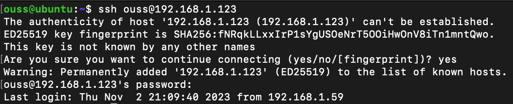
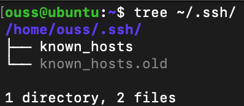
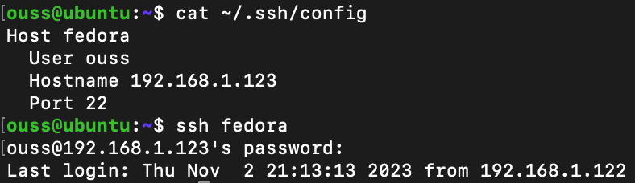
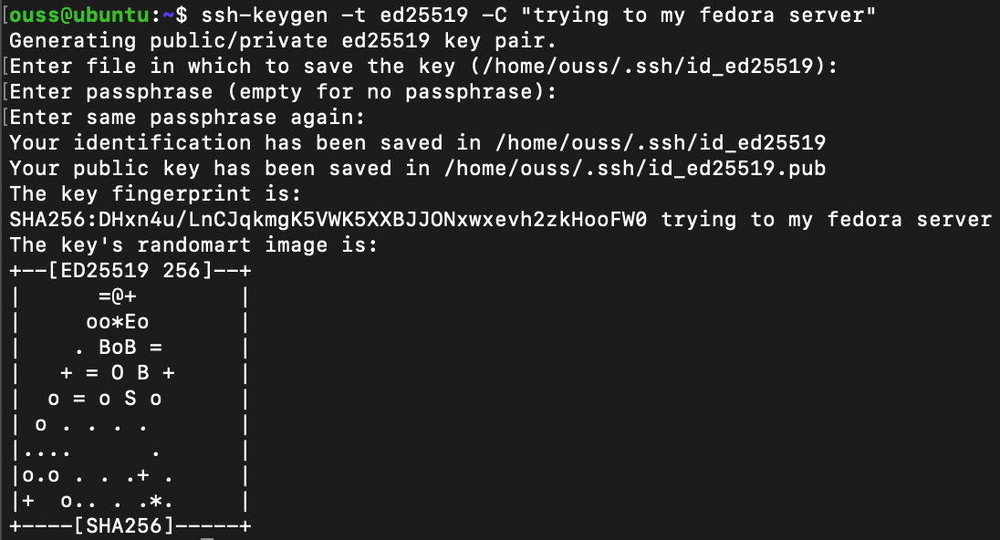
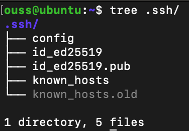
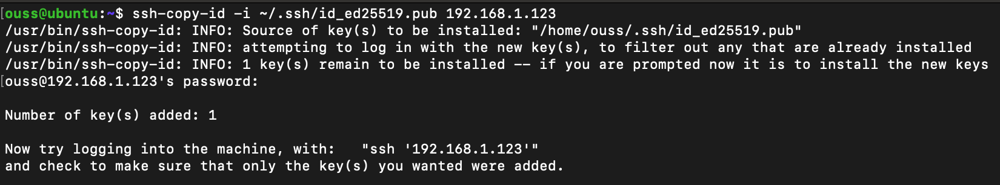
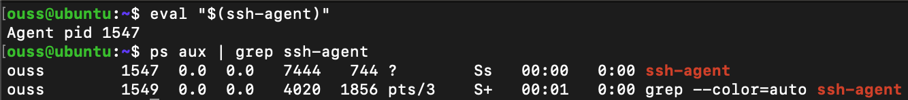
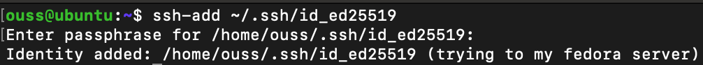

# OpenSSH

## Definition

**OpenSSH** is a **remote management tool**, that gives you access to run commands on another machine from your own machine.

OpenSSH is developed by OpenBSD project.

OpenSSH is kind of the standard for remote access tools in the Linux community.  

OpenSSH is a suite of utilities (binaries), the two most important are the server and the client components.

##  Install openssh-client

#### Check if openssh-client is installed
```bash
which ssh
```
If the command returns the ssh binary path (commonly **/usr/bin/ssh**), it means openssh-client is already installed.

Otherwise, you could search for the package using your package manager. 

###### Debian-based Linux distros (Ubuntu, Mint, ...)
```bash
apt search openssh-client
```
###### RPM-based Linux distros (RHEL, CentOS, Fedora, ...)
```bash
[yum|dnf] search openssh-clients
```

The output should mention the package if it exists.

The openssh-client is installed by default on most Linux instances. Otherwise, you can install it running the command bellow.
###### Debian-based Linux distros (Ubuntu, Mint, ...)
```bash
apt install -y openssh-client
```
###### RPM-based Linux distros (RHEL, CentOS, Fedora, ...)
```bash
[yum|dnf] install -y openssh-clients
```

And that's it! You should be able now to connect to a remote machines.  

If you encounter any problems, you can start troubleshooting by checking the service status using systemctl.
```bash
systemctl status sshd
```
Note: for Debian-based Linux distros you can use interchangeably **ssh** and **sshd**, not the case in RPM-based Linux distros where you must use only **sshd**.

## Connect to a remote machine using OpenSSH Client
#### Remote machine prerequisites
1. Install **openssh-server** package.
2. Allows traffic incoming via port 22.

#### Connect to remote machine using OpenSSH Client
Once the prerequisites above are satisfied, you can go ahead and connect to the remote machine.
```bash
ssh -p <PORT_NUMBER> <YOUR_REMOTE_SERVER_USERNAME>@<YOUR_REMOTE_SERVER_IP_ADDRESS>
``` 



For the very first time you are trying to connect to the remote machine, you'll be asked if you are sure you want to connect, just type yes. After that, you'll be asked to type the password for that specific user you want to connect with. Type the password and hit enter.

On the very first ssh connection to a remote machine,
the **.ssh** directory is created inside the home directory
which contains the **known_hosts** file that stores all the servers fingerprints. That way it'll not ask you again for the connection confirmation.       
One other utility of the **known_hosts** file is that is preventing cyberattacks like Man-in-the-middle attack.



## Keep track of ssh auth attempts
As an administrator,
you could tail the file /var for whatever your purpose
to see logs that describe what's going on when another machine tries to connect to the remote sever.

The file location depends on the Linux instance used.
In Debian-based Linux Distros you can find it under **/var/log/auth.log**.

## Simplify ssh connection with config file
As you may have noticed, connecting to a remote machine via ssh requires providing much information
(username, ip address, port number, ...).
In the real world, you usually connect to many instances.
Which makes the process of keeping track of all prams for each even harder. 
Fortunately, you can store that information in a specific file under **~/.ssh/config** and gives them an id.
That way you only need to provide that id,
the openssh then will grab all the needed information by looking at that specific file.



Note: **~/.ssh/config** override the system config file that you can find at **/etc/ssh/ssh_config**

## Using public/private keys
#### Create a key pair (from the client instance)
```bash
ssh-keygen -t [ed25519|rsa|dsa|ecdsa|<YOUR_PUBLIC_KEY_ALGORITHM>] -C "<YOUR_COMMENT>"
```



The public and private key will be respectively created under **~/.ssh/id_ed25519.pub** and **id_ed25519**.
Note: providing a passphrase is recommended for security purposes.



#### Share the public key with the remote server
###### Method 1: Copy/paste the pub key manually
Copy **~/.ssh/id_ed25519.pub** content and paste it in **~/.ssh/authorized_keys**.
###### Method 2: Automatically with one command
```bash
ssh-copy-id -i <PATH_TO_YOUR_PUB_KEY> -p <PORT_NUMBER> <YOUR_IP_ADDRESS>
```


As a result, your ssh connection is not password-based anymore.
Its keys-based and you'll be asked to enter your passphrase instead of the password.

#### Connect to a remote server using keyfile-based ssh
```bash
ssh -i <PATH_TO_YOUR_PRIVATE_KEY> -p <PORT_NUMBER> <YOUR_REMOTE_SERVER_USERNAME>@<YOUR_REMOTE_SERVER_IP_ADDRESS>
``` 
Note: If you kept the default suggested private file (name and path), there is no need to provide the private file.

#### ssh-agent
**ssh-agent** helps you cash the key in-memory so that you only need to enter the passphrase onetime and then the key is unlocked for every connection attempt in the current session.
###### Check if ssh-agent is running
```bash
ps aux | grep ssh-agent 
```


###### run the ssh-agent
```bash
eval $(ssh-agent) 
```


###### Add a private key to the ssh-agent
To unlock the private key for the whole session, you can use ssh-add utility.
```bash
ssh-add <PATH_TO_YOUR_PRIVATE_KEY> 
```


Now next time you'll try to connect to the remote server via ssh, it should not ask for the passphrase.


## SSH Server Configuration
The main file that you'll find your self modifying
whenever you want to change the server ssh configuration is **/etc/ssh/sshd_config**.

###### Change the Default SSH Port Number (22)
You can do that by changing the **Port** key value inside the **sshd_config** file.

###### Disable Permit Root Login
You can do that by setting the **PermitRootLogin** key value to **no** inside the **sshd_config** file.

Note: It is highly recommended to disable the ssh root login. 

###### Disable Password Authentication
You can do that by setting the **PasswordAuthentication** key value to **no** inside the **sshd_config** file.

Note: It is highly recommended to disable the password authentication to force the keyfile-based authentication.

## Troubleshooting
You can help debugging the situation by following the logs.

#### Method 1
###### Debian-based Linux instances (tested on Ubuntu)
```bash
tail -f /var/log/auth.log
```
###### RPM-based Linux instances (tested on Fedora)
```bash
tail -f /var/log/secure
```

#### Method 2
###### Debian-based Linux instances (tested on Ubuntu)
```bash
journalctl -fu ssh
```
###### RPM-based Linux instances (tested on Fedora)
```bash
journalctl -fu sshd
```

## Quick tips using ssh

#### Execute one command against the remote instance

```bash
ssh -p <PORT_NUMBER> <YOUR_REMOTE_SERVER_USERNAME>@<YOUR_REMOTE_SERVER_IP_ADDRESS> ls
```