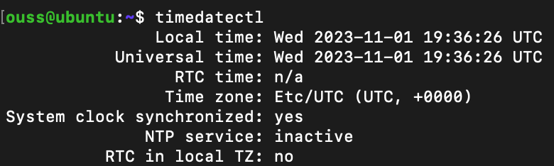
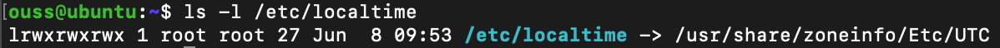
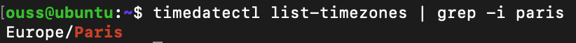
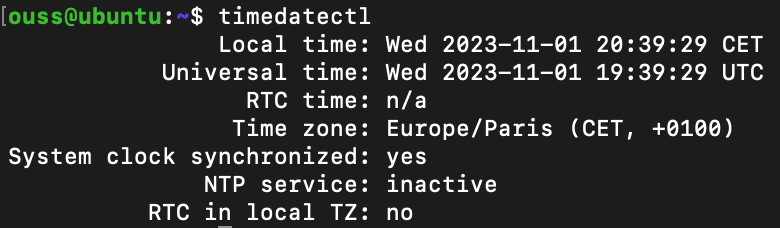

# Time Zone

## Checking the Current Time Zone

###### Method 1
```bash
timedatectl
```


###### Method 2
```bash
ls -l /etc/localtime
```


## Changing the Time Zone

###### Checking available Time Zones
```bash
timedatectl timedatectl list-timezones
```

Note: You can use grep command utility to make the search process faster.   
Example for Europe/Paris timezone.



###### Changing the Time Zone
```bash
timedatectl set-timezone <YOUR_TIME_ZONE>
```

###### Final check
```bash
timedatectl
```
